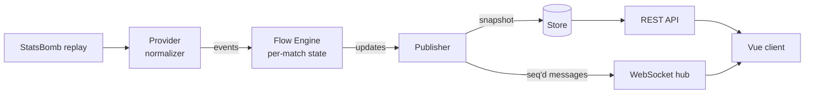

# FlowScore

[](https://github.com/ssuleimenovv/flowScore/actions/workflows/ci.yml)

**Live football analytics that shows *who is controlling the game right now* — and why.**

**Live demo:** <https://flowscore-pi.vercel.app/matches/3754314> ·
[“What if?” simulator](https://flowscore-pi.vercel.app/matches/3754314/simulator)

FlowScore turns the raw event stream of a football match (shots, corners, cards,
possession) into **Flow Momentum**: a 0–100 score per team that rises with pressure
and decays when it fades. On top of it: a minute-by-minute flow wave, a chronicle
that shows how much each event moved the flow, live match stats, an explanation of
what drives the flow with a short AI analysis, in-play win/draw/loss probabilities,
our own xG model and a "what if?" simulator.

> Status: **early, actively developed, deployed.** The demo replays six Premier
> League matches of 2015/16 on a staggered schedule, as if they were live. The free backend sleeps when
> idle, so the first visit can take up to a minute to wake it. See the roadmap below.

---

## Why not just another score app

Momentum graphs exist elsewhere. FlowScore's goal is to make the metric
**transparent and measurable**:

- **A published formula** ([docs/FLOW.md](docs/FLOW.md)): exponential decay instead
  of fixed windows, saturation to 0–100, a halftime reset, a base level so a playing
  team never shows zero.
- **Explainable by construction.** Flow is a sum of decaying event contributions,
  so every value can be broken down into the events that caused it ("4 shots in
  7 minutes: +14").
- **Validated on a season.** On 380 Premier League matches (time-blocked
  cross-validation, every match predicted by a model that never saw it), Flow
  predicts whether a team shoots in the next 10 minutes better than the base
  rate: AUC 0.566, log-loss gain 95% CI [0.003, 0.007]. The signal is modest and
  reported as such. The same check fixed three weights, including one with the
  wrong sign ([docs/FLOW.md, section 8](docs/FLOW.md)).
- **An outcome model that says what it can't do.** In-play win/draw/loss
  probabilities from a Poisson goal model (score, time left, team rating, red
  cards, a draw fix): log loss 0.746 vs 1.091 for the base rates, calibrated
  within 3 points. Adding Flow or xG does not improve it (95% CI of the gain
  includes zero), so Flow stays a "who is pressing now" signal and is not sold
  as a predictor ([docs/PREDICTION.md](docs/PREDICTION.md)).
- **Our own xG model** for sources that do not provide xG: a logistic regression on
  distance, angle, header and what led to the shot. On 9,908 shots it scores log
  loss 0.272 against 0.325 for the base rate and 0.255 for StatsBomb's xG, which
  also sees the keeper and the defenders: 75% of the way, calibrated within a
  few points. Go matches the Python fit to 1e-16 ([docs/XG.md](docs/XG.md)).
- **AI analysis that only retells facts.** At every tenth minute, a goal or a red
  card, an LLM (Gemini) gets the score, each team's Flow and its factors, the key
  events and the chances, and writes two or three sentences; it is told to invent
  nothing. One request at a time, a wait on 429, and every text kept in a file, so
  the deployed demo spends no quota at all.

---

## What works today

**Backend (Go)**
- StatsBomb Open Data replay provider: plays a historical match "live" at any
  speed (×1…×600), with possession reconstructed per minute and player nicknames
  from lineups.
- Flow Engine: per-match state, decay ticker, halftime handling, event weights.
- Live publisher: turns engine updates into contract messages and keeps a match
  snapshot; every message carries a `seq`.
- WebSocket hub (`coder/websocket`): fan-out per match, slow clients are dropped
  instead of blocking others.
- REST snapshot: `/api/v1/matches`, `/api/v1/matches/{id}`, `/flow`, `/events`,
  `/insight`.
- A schedule of six demo matches: each is announced, played and kept on the list
  for a while, then replayed, staggered so some are always live.
- Analysis agent (`internal/insight`): a queue in front of the LLM with a timeout,
  a pause under the rate limit, a wait on 429, a cache keyed by moment and kept on
  disk; the provider sits behind a `Writer` interface.
- Our xG model in Go (`internal/xg`) on every shot, next to StatsBomb's.
- Outcome model in Go, matching the Python fit to 1e-15 on 306 checked cases;
  chances go out on the stream when a whole percent changes.
- `POST /simulate`: the chances with red cards added later in the match; the rest
  of the match is split at each red, every piece with its own goal rates.
- Match stats computed from events: possession, shots, on target, xG, key passes,
  tackles.
- Halftime and full-time whistles, first-half score, a clock resynced with every
  update.

**Frontend (Vue 3 + TypeScript)**
- Home screen: live matches with score, flow sparkline, share bar and the AI
  headline; the biggest Flow rises of the last 5 minutes; later today; the day's
  forecast.
- Match screen per the design mockup: scoreboard with live clock, Flow share bar,
  flow wave (1/5/15-minute smoothing, hover readout, goal markers), chronicle with
  Flow impact per event and both xG values per shot, match stats, the AI analysis
  next to "why Flow is what it is" factors, outcome probabilities with the change
  since kick-off, and after the final whistle the result against what the model
  expected.
- Simulator screen: pick a red card and a minute, see the scenario against the
  match as it stands and why it moved.
- Two layouts from one DOM: two-column desktop, tabbed phone view
  (`Поток / События / Стат. / AI`) with the tab kept in the URL.
- **Snapshot + stream merge:** the client loads a REST snapshot, buffers stream
  messages meanwhile, applies only messages newer than each part of the snapshot,
  and reloads on any `seq` gap.
- Reconnect with exponential backoff and jitter, offline and reconnect banners,
  skeletons, empty, error and 404 states.
- Light and dark themes via design tokens, reduced-motion support, keyboard and
  screen-reader friendly tabs.

**Contract-first:** [api/openapi.yaml](api/openapi.yaml) is the single source of
truth; the frontend types are generated from it.

---

## Architecture



The client never trusts ordering by luck: the snapshot and every message carry a
`seq`. The publisher writes the store *before* sending a message, so a snapshot is
never behind a message a client has already received.

The target architecture (auth, ingest from live sources, Postgres/Redis, AI
orchestrator in Python, push notifications) is described in
[docs/ARCHITECTURE.md](docs/ARCHITECTURE.md).

---

## Tech stack

| Layer | Tools |
|---|---|
| Backend | Go 1.24, `net/http`, `coder/websocket` |
| Frontend | Vue 3.5, TypeScript, Vite, Pinia, Vue Router |
| Motion | GSAP, Lenis, Rive, Three.js (lazy) |
| Contract | OpenAPI 3.1, `openapi-typescript` |
| Quality | Go tests, Vitest, Playwright, ESLint, Oxlint, Prettier, `vue-tsc` |
| ML | Python, numpy, pandas, SciPy, scikit-learn |
| Data | StatsBomb Open Data (demo and validation) |
| Deploy | Docker (distroless, 19 MB), Render, Vercel, GitHub Actions |
| AI | Gemini API (`google.golang.org/genai`), structured output |
| Planned | PostgreSQL, Redis, Capacitor for iOS/Android |

---

## Repository layout

```
ai/calibration  Flow validation on a StatsBomb season (Python)
ai/prediction   Outcome model: dataset, fit, validation, model.json (Python)
ai/xg           Our xG model: shots, fit, validation, model.json (Python)
api/            OpenAPI contract (REST + WebSocket messages)
docs/           Architecture and the Flow Momentum spec
design/         Mockups the UI follows
services/       Go backend
  cmd/gateway   HTTP + WebSocket server with a looping demo replay
  cmd/replay    Terminal replay: prints Flow minute by minute
  cmd/export    A StatsBomb season as CSV for ai/calibration
  internal/
    event/      Normalized event model
    flow/       Flow Engine (state, decay, weights)
    live/       Publisher, snapshot store, hub, stats
    api/        REST handlers, CORS
    predict/    Outcome model and "what if" simulation
    xg/         Our xG model
    insight/    AI analysis agent: queue, cache, Gemini writer
    provider/   Data sources (StatsBomb replay)
  demo/         The demo matches the deployed gateway replays, and their analysis
  Dockerfile    The gateway image for Render
web/            Vue client
  src/features/home        Home screen
  src/features/match       Match screen logic and components
  src/features/simulator   "What if?" screen
  src/shared           API client, live socket, UI kit, theme, motion
```

---

## Running locally

**Requirements:** Go 1.24+, Node 22.18+ or 24.12+.

**1. Backend.** The demo match is committed in `services/demo`. From `services/`:

```bash
go run ./cmd/gateway -data demo/statsbomb -matches matches-demo.json
go run ./cmd/gateway -data demo/statsbomb -matches matches-demo.json -speed 600   # a match in ~10 s
```

The six demo matches run on their own schedule from the start. The AI analysis of
the demo is in `demo/insights.json`; with `GEMINI_API_KEY` set, the gateway also
asks Gemini about moments it has no text for and adds them to the file. For the
whole 2015/16 season (needed by `ai/`), run `python ai/calibration/download.py`
and start the gateway without `-data`.

**2. Frontend.** From `web/`:

```bash
npm install
npm run dev
```

Open <http://localhost:5173/>. Vite proxies `/api` and `/ws` to the
gateway.

**Docker** (the image Render runs). From the repo root:

```bash
docker build -f services/Dockerfile -t flowscore-gateway .
docker run --rm -p 8080:8080 flowscore-gateway
```

---

## Deploy

Every push to `main` runs [CI](.github/workflows/ci.yml): Go format, vet and tests;
type-check, lint, unit tests and build of the web app; the Docker image build.

| Part | Host | Settings |
|---|---|---|
| Gateway | Render, Docker, free | `services/Dockerfile`, context `.`, health check `/healthz`, auto-deploy on commit, `FLOWSCORE_ORIGINS=flowscore.vercel.app,flowscore-*.vercel.app`, `GEMINI_API_KEY` |
| Web | Vercel | root `web`, `VITE_API_URL=https://flowscore-api-7nwl.onrender.com` |

The gateway reads its settings from flags or the environment: `PORT`,
`FLOWSCORE_DATA`, `FLOWSCORE_MATCHES`, `FLOWSCORE_MODEL`, `FLOWSCORE_XG_MODEL`,
`FLOWSCORE_MATCH`, `FLOWSCORE_ORIGINS` (host patterns allowed to call the API and
the stream), `FLOWSCORE_INSIGHTS`, `FLOWSCORE_LLM_MODEL`; the Gemini key comes only
from `GEMINI_API_KEY`.

### Checks

```bash
# services/
go vet ./... && go test ./...

# web/
npm run type-check
npm run lint
npm run test:unit -- --run
npm run api:types    # regenerate types after changing api/openapi.yaml
```

---

## Roadmap

- [x] Event model, StatsBomb replay, Flow Engine
- [x] WebSocket hub, REST snapshot, seq-based consistency
- [x] Match screen: scoreboard, flow wave, chronicle, stats, phone tabs
- [x] Flow validation on 380 matches: time-blocked CV, bootstrap intervals
- [x] Explainability: top contributing factors per moment
- [x] Outcome model: Poisson in-play, validated on 380 matches
- [x] Outcome probabilities live on the Match screen
- [x] "What if?" simulator: red cards (players and Flow forecast to come)
- [x] Deploy: Docker, Render, Vercel, CI on every push
- [x] Home screen with six demo matches on a schedule
- [x] AI match analysis (Gemini), kept per moment
- [x] Own xG model, validated on 9,908 shots
- [ ] League, team and player screens
- [ ] Auth, favorites, Flow spike notifications
- [ ] Live data source, iOS and Android builds

---

## How it's built

A solo project built to learn production-grade Go, real-time systems and applied
ML end to end. Every line is typed,
read and understood by the author, and design decisions are documented in
[docs/](docs/).

---

## Data attribution

Demo and training data: **[StatsBomb Open Data](https://github.com/statsbomb/open-data)**.
Used under the StatsBomb public data user agreement, which requires attribution;
the app credits it on every page.
