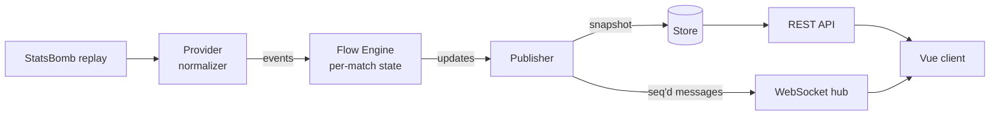

# FlowScore

**Live football analytics that shows *who is controlling the game right now* — and why.**

FlowScore turns the raw event stream of a football match (shots, corners, cards,
possession) into **Flow Momentum**: a 0–100 score per team that rises with pressure
and decays when it fades. On top of it: a minute-by-minute flow wave, a chronicle
that shows how much each event moved the flow, live match stats, and (in progress)
an AI layer that explains the numbers, predicts the outcome and runs "what if?"
scenarios.

> Status: **early, actively developed.** The Match screen works end to end on a
> replayed Premier League match (Man City 2–2 Arsenal, 2016). See the roadmap below.

---

## Why not just another score app

Momentum graphs exist elsewhere. FlowScore's goal is to make the metric
**transparent and measurable**:

- **A published formula** ([docs/FLOW.md](docs/FLOW.md)): exponential decay instead
  of fixed windows, saturation to 0–100, a halftime reset, a base level so a playing
  team never shows zero.
- **Explainable by construction.** Flow is a sum of decaying event contributions,
  so every value can be broken down into the events that caused it ("4 shots in
  7 minutes: +14").
- **Calibrated, not hand-tuned** *(next step)*: weights fitted on 380 StatsBomb
  matches so that Flow predicts shots and goals in the next 10 minutes, with
  log loss reported against a naive baseline.
- **Own xG model** *(planned)* for sources that do not provide xG.

---

## What works today

**Backend (Go)**
- StatsBomb Open Data replay provider: plays a historical match "live" at any
  speed (×1…×600), with possession reconstructed per minute and player nicknames
  from lineups.
- Flow Engine: per-match state, decay ticker, halftime handling, event weights.
- Live publisher: turns engine updates into contract messages and keeps a match
  snapshot; every message carries a `seq`.
- WebSocket hub (`coder/websocket`): fan-out per match, slow clients are dropped
  instead of blocking others.
- REST snapshot: `/api/v1/matches/{id}`, `/flow`, `/events`.
- Match stats computed from events: possession, shots, on target, xG, key passes,
  tackles.
- Halftime and full-time whistles, first-half score, a clock resynced with every
  update.

**Frontend (Vue 3 + TypeScript)**
- Match screen per the design mockup: scoreboard with live clock, Flow share bar,
  flow wave (1/5/15-minute smoothing, hover readout, goal markers), chronicle with
  Flow impact per event, match stats, "What if?" call to action.
- Two layouts from one DOM: two-column desktop, tabbed phone view
  (`Поток / События / Стат. / AI`) with the tab kept in the URL.
- **Snapshot + stream merge:** the client loads a REST snapshot, buffers stream
  messages meanwhile, applies only messages newer than each part of the snapshot,
  and reloads on any `seq` gap.
- Reconnect with exponential backoff and jitter, offline and reconnect banners,
  skeletons, empty, error and 404 states.
- Light and dark themes via design tokens, reduced-motion support, keyboard and
  screen-reader friendly tabs.

**Contract-first:** [api/openapi.yaml](api/openapi.yaml) is the single source of
truth; the frontend types are generated from it.

---

## Architecture



The client never trusts ordering by luck: the snapshot and every message carry a
`seq`. The publisher writes the store *before* sending a message, so a snapshot is
never behind a message a client has already received.

The target architecture (auth, ingest from live sources, Postgres/Redis, AI
orchestrator in Python, push notifications) is described in
[docs/ARCHITECTURE.md](docs/ARCHITECTURE.md).

---

## Tech stack

| Layer | Tools |
|---|---|
| Backend | Go 1.24, `net/http`, `coder/websocket` |
| Frontend | Vue 3.5, TypeScript, Vite, Pinia, Vue Router |
| Motion | GSAP, Lenis, Rive, Three.js (lazy) |
| Contract | OpenAPI 3.1, `openapi-typescript` |
| Quality | Go tests, Vitest, Playwright, ESLint, Oxlint, Prettier, `vue-tsc` |
| Data | StatsBomb Open Data (demo and training) |
| Planned | Python (FastAPI) for ML, PostgreSQL, Redis, Capacitor for iOS/Android |

---

## Repository layout

```
api/            OpenAPI contract (REST + WebSocket messages)
docs/           Architecture and the Flow Momentum spec
design/         Mockups the UI follows
services/       Go backend
  cmd/gateway   HTTP + WebSocket server with a looping demo replay
  cmd/replay    Terminal replay: prints Flow minute by minute
  internal/
    event/      Normalized event model
    flow/       Flow Engine (state, decay, weights)
    live/       Publisher, snapshot store, hub, stats
    api/        REST handlers
    provider/   Data sources (StatsBomb replay)
web/            Vue client
  src/features/match   Match screen logic and components
  src/shared           API client, live socket, UI kit, theme, motion
```

---

## Running locally

**Requirements:** Go 1.24+, Node 22.18+ or 24.12+.

**1. Demo data** (StatsBomb Open Data, not committed). From `services/`:

```bash
mkdir -p data/statsbomb
BASE=https://raw.githubusercontent.com/statsbomb/open-data/master/data
curl -L -o data/statsbomb/matches-2-27.json      $BASE/matches/2/27.json
curl -L -o data/statsbomb/events-3754314.json    $BASE/events/3754314.json
curl -L -o data/statsbomb/lineups-3754314.json   $BASE/lineups/3754314.json
```

**2. Backend.** From `services/`:

```bash
go run ./cmd/gateway              # :8080, replay at ×60
go run ./cmd/gateway -speed 600   # a full match in about 10 seconds
```

The replay starts when the first viewer connects and loops while anyone watches.

**3. Frontend.** From `web/`:

```bash
npm install
npm run dev
```

Open <http://localhost:5173/matches/3754314>. Vite proxies `/api` and `/ws` to the
gateway.

### Checks

```bash
# services/
go vet ./... && go test ./...

# web/
npm run type-check
npm run lint
npm run test:unit -- --run
npm run api:types    # regenerate types after changing api/openapi.yaml
```

---

## Roadmap

- [x] Event model, StatsBomb replay, Flow Engine
- [x] WebSocket hub, REST snapshot, seq-based consistency
- [x] Match screen: scoreboard, flow wave, chronicle, stats, phone tabs
- [ ] Flow calibration on 380 matches (log loss vs baseline)
- [ ] Explainability: top contributing factors per moment
- [ ] Outcome prediction and AI match analysis (Python service)
- [ ] "What if?" simulator
- [ ] Home, league, team and player screens
- [ ] Auth, favorites, Flow spike notifications
- [ ] Live data source, deploy, iOS and Android builds

---

## How it's built

A solo project built to learn production-grade Go, real-time systems and applied
ML end to end. Every line is typed,
read and understood by the author, and design decisions are documented in
[docs/](docs/).

---

## Data attribution

Demo and training data: **[StatsBomb Open Data](https://github.com/statsbomb/open-data)**.
Used under the StatsBomb public data user agreement, which requires attribution.
